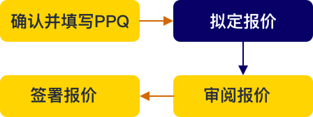

### <b class='page-num'>1.1</b> 服务手册使用指南
1、制作背景  
为使管理人更好地理解、办理中信托管外包业务，尤其是熟练使用管理人服务平台各项功能与菜单，我部最新改版，采用网页化，集成了中信最新的业务和服务，供各位管理人参考查阅。  
2、查阅方式  
网页版地址：  https://iservice.citics.com/guidebook/#/    
### <b class='page-num'>1.2</b> 了解中信服务

### <b class='page-num'>1.3</b>了解中信服务渠道
**1.3.1微信公众号简介**  
我司于2015年推出“中信证券基金运营服务”微信公众号，我们将行业政策解析、业务介绍及平台交互等功能搬到云端，帮助管理人随时掌握业务动态，让中信证券成为您的贴身助理！  
1、平台接入方式  
登录微信，搜索公众号“中信证券基金运营服务”（微信右上角->添加朋友->点下方公众号），或者扫描下方的二维码，关注我们的微信公众号，一秒即可开启使用之旅。  

**1.3.2客服微群简介**  
1、网页端接入  
点击云平台右侧的|图标，进入智能客服界面，点击下图中箭头所指的“人工客服”，即可进去在线人工客服。  

中信证券基金运营服务联系人清单  
<table style="text-align:center;">
    <tr>
        <th colspan="2">业务分类</th>
        <th>说明</th>
        <th>联系人</th>
        <th>工作邮箱</th>
        <th>联系电话</th>
        <th>手机</th>
    </tr>
    <tr>
        <td rowspan="15">市场</td>
        <td rowspan="11">&nbsp;</td>
        <td rowspan="2">北京、天津及北方地区
        <td>拓展</td>
        <td>Tuozhan@citics.com</td>
        <td>010-60834338</td>
        <td>13261336486</td>
    </tr>
    <tr>
        <td>桑育夫</td>
        <td>Sangyufu@citics.com</td>
        <td>010-60834337</td>
        <td>13717959943</td>
    </tr>
    <tr>
        <td rowspan="4">上海、浙江、江苏地区</td>
        <td>高翔</td>
        <td>gx@citics.com</td>
        <td>010-60838262</td>
        <td>15600233456</td>
    </tr>
    <tr>
        <td>柯沛</td>
        <td>Kepei@citics.com</td>
        <td>021-20262220</td>
        <td>13564478626</td>
    </tr>
    <tr>
        <td>姚凌</td>
        <td>yaoling@citics.com</td>
        <td>021-20262224</td>
        <td>13917523849</td>
    </tr>
    <tr>
        <td>冷寒</td>
        <td>Lenghan@citics.com</td>
        <td>0755-23835495</td>
        <td>18718775323</td>
    </tr>
    <tr>
        <td rowspan="2">深圳、湖南、四川、云南、海南及广西地区</td>
        <td>明悦</td>
        <td>mingyue@citics.com</td>
        <td>0755-23835112</td>
        <td>13501599253</td>
    </tr>
    <tr>
        <td>李昕</td>
        <td>Li_xin@citics.com</td>
        <td>0755-23835499</td>
        <td>13632950853</td>
    </tr>
    <tr>
        <td rowspan="3">广东、湖北、江西、安徽、福建</td>
        <td>何江</td>
        <td>hejiang@citics.com</td>
        <td>0755-23835366</td>
        <td>13823196490</td>
    </tr>
    <tr>
        <td>戴晓真</td>
        <td>daixiaozhen@citics.com</td>
        <td>020- 87593847</td>
        <td>13631325879</td>
    </tr>
    <tr>
        <td>鲁旭芬</td>
        <td>Luxufen@citics.com</td>
        <td>020- 87592171</td>
        <td>18802086072</td>
    </tr>
    <tr>
        <td rowspan="4">同业</td>
        <td rowspan="2">公募基金管理公司及其资产管理子公司</td>
        <td>连凯</td>
        <td>liankai@citics.com</td>
        <td>010-60834302</td>
        <td>13810037050</td>
    </tr>
    <tr>
        <td>陈巍</td>
        <td>cw@citics.com</td>
        <td>010-60834306</td>
        <td>15801229820</td>
    </tr>
    <tr>
        <td rowspan="2">证券公司资管部门、期货公司资产管理子公司、第三方基金销售公司、境外资管机构</td>
        <td>刘玥娅</td>
        <td>liuyueya@citics.com</td>
        <td>010-60834280</td>
        <td>13810533387</td>
    </tr>
    <tr>
        <td>张嘉骥</td>
        <td>Zhangjiaji@citics.com</td>
        <td>010-60834209</td>
        <td>15201250211</td>
    </tr>
    <tr>
        <td rowspan="2">客户服务</td>
        <td rowspan="2">统一客户服务专线</td>
        <td>统一业务咨询</td>
        <td>&nbsp;</td>
        <td>cust_serv@citics.com</td>
        <td colspan="2">95548转3托管业务</td>
    </tr>
    <tr>
        <td>私募登记备案咨询热线</td>
        <td>&nbsp;</td>	
        <td>&nbsp;</td>
        <td colspan="2">方式1：95548-3-2 方式2：专有热线4009158496</td>
    </tr>
    <tr>
        <td rowspan="21">总协调</td>
        <td rowspan="3">运营总协调人</td>
        <td>运营总体协调1</td>
        <td>查韩锋</td>
        <td>zhahf@citics.com</td>
        <td>010-60834278</td>
        <td>15718815957</td>
    </tr>
    <tr>
        <td>运营总体协调2</td>
        <td>刘宝义</td>
        <td>liubaoyi@citics.com</td>
        <td>010-60834276</td>
        <td>13810509482</td>
    </tr>
    <tr>
        <td>运营应急事件处置</td>
        <td>孙学卿</td>
        <td>sunxueqing@citics.com</td>
        <td>010-60834277</td>
        <td>13853203345</td>
    </tr>
    <tr>
        <td rowspan="12">各业务组协调人</td>
        <td rowspan="2">产品合同 服务协议</td>
        <td>布豫坤</td>
        <td>buyukun@citics.com</td>
        <td>010-60834293</td>
        <td>18600019367</td>
    </tr>
    <tr>
        <td>王庆红</td>
        <td>wangqinghong@citics.com</td>
        <td>010-60834301</td>
        <td>13701208440</td>
    </tr>
    <tr>
        <td >估值核算和信息披露</td>
        <td>饶林</td>
        <td>rl@citics.com</td>
        <td>010-60834239</td>
        <td>13810008555</td>
    </tr>
    <tr>
        <td rowspan="2">直销和注册登记</td>
        <td>张秋然</td>
        <td>zhangqiuran@citics.com</td>
        <td>010-60834210</td>
        <td>18515633019</td>
    </tr>
    <tr>
        <td>金依丽</td>
        <td>jinyili@citics.com</td>
        <td>010-60834206</td>
        <td>15057901582</td>
    </tr>
    <tr>
        <td>外包资金划付</td>
        <td>李佳丽</td>
        <td>ljl@citics.com</td>
        <td>010-60834201</td>
        <td>18911011883</td>
    </tr>
    <tr>
        <td>托管资金划付</td>
        <td>马洪印</td>
        <td>mahongyin@citics.com</td>
        <td>010-60834260</td>
        <td>13261271320</td>
    </tr>
    <tr>
        <td>投资监督</td>
        <td>苗广斌 </td>
        <td>miaoguangbin@citics.com</td>
        <td>010-60834268</td>
        <td>18600263266</td>
    </tr>
    <tr>
        <td>绩效评价</td>
        <td>田军</td>
        <td>tianjun@citics.com</td>
        <td>010-60836104</td>
        <td>18511708813</td>
    </tr>
    <tr>
        <td>境外业务</td>
        <td>&nbsp;</td>
        <td>&nbsp;</td>
        <td>&nbsp;</td>
        <td>&nbsp;</td>
    </tr>
    <tr>
        <td>代理结算</td>
        <td>&nbsp;</td>
        <td>&nbsp;</td>
        <td>&nbsp;</td>
        <td>&nbsp;</td>
    </tr>
    <tr>
        <td>客户方案</td>
        <td>&nbsp;</td>
        <td>&nbsp;</td>
        <td>&nbsp;</td>
        <td>&nbsp;</td>	
    </tr>
    <tr>
        <td rowspan="6">运营经理</td>
        <td>北京、天津及北方地区</td>
        <td>李露梅</td>
        <td>lilumei@citics.com</td>
        <td>010-60834286</td>
        <td>15210808707</td>
    </tr>
    <tr>
        <td>上海地区</td>
        <td>徐淼</td>
        <td>xumiao@citics.com</td>
        <td>010-60834310</td>
        <td>18710078223</td>
    </tr>
    <tr>
        <td>深圳、华南地区</td>
        <td>邓超群</td>
        <td>dcq@citics.com</td>
        <td>0755-23835496</td>
        <td>13751181842</td>
    </tr>
    <tr>
        <td>广东、湖北、江西、福建</td>
        <td>罗虹艳</td>
        <td>luohongyan@citics.com</td>
        <td>020- 87592360</td>
        <td>13763392393</td>
    </tr>
    <tr>
        <td>江苏、浙江、安徽地区</td>
        <td>李晨</td>
        <td>Lichen@citics.com</td>
        <td>010- 60838971</td>
        <td>13811576064</td>
    </tr>
    <tr>
        <td>湖南、重庆、四川、广西</td>
        <td>陆敏生</td>
        <td>luminsheng@citics.com</td>
        <td>&nbsp;</td>
        <td>13450465162</td>
    </tr>
    <tr>
        <td rowspan="3">服务协议</td>
        <td>行政服务（外包）协议</td>
        <td>请于产品发行前签署完毕</td>
        <td rowspan="2">计玉华</td>
        <td rowspan="3">zxzzcont@citics.com</td>
        <td rowspan="2">021-20262225</td>
        <td rowspan="2">15601913080</td>
    </tr>
    <tr>
        <td>账户监督协议</td>
        <td>请于产品发行前签署完毕</td>
    </tr>
    <tr>
        <td>证券经纪服务协议、期货交易结算服务协议</td>
        <td>请于产品三方关联之前签署完毕</td>
        <td>&nbsp;</td>
        <td>&nbsp;</td>	
        <td>&nbsp;</td>				
    </tr>
    <tr>
        <td rowspan="8">账户服务</td>
        <td>开立基金募集账户</td>
        <td>无须管理人提供材料和发起</td>
        <td>倪亚楠</td>
        <td>fafund@citics.com</td>
        <td>010-60834202</td>
        <td>13718284530</td>
    </tr>
    <tr>
        <td>开立托管账户</td>
        <td>--</td>
        <td>崔元克</td>
        <td>cuscs@citics.com</td>
        <td>010-60836407/</td>
        <td>18695906890</td>
    </tr>
    <tr>
        <td>注销托管账户</td>
        <td>&nbsp;</td>
        <td>向丹丹</td>
        <td>cuscs@citics.com</td>
        <td>010-60834249</td>
        <td>18612982190</td>
    </tr>
    <tr>
        <td>证券账户开户（股卡）</td>
        <td>--</td>
        <td>秦秋湜</td>
        <td>gkkh@citics.com</td>
        <td>010-60834273</td>
        <td>15810259972</td>
    </tr>
    <tr>
        <td>三方存管关联银期转账关联</td>
        <td>&nbsp;</td>
        <td>蔡文闻</td>
        <td>tgjsgl@citics.com</td>
        <td>010-60834270</td>
        <td>13522893309</td>
    </tr>
    <tr>
        <td rowspan="2">银行间债券市场备案及开户</td>
        <td rowspan="2">--</td>
        <td>赵子龙/</td>
        <td>zhaozilong@citics.com</td>
        <td>010-60834261</td>
        <td>13488863583</td>
    </tr>
    <tr>
        <td>崔元克（备）</td>
        <td>cuscs@citics.com</td>
        <td>010-60836407</td>
        <td>18695906890</td>
    </tr>
    <tr>
        <td>中登结算路径 办理中登结算路径、席位绑定关系</td>
        <td>--</td>
        <td>赵子春</td>
        <td>zhaozichun@citics.com</td>
        <td>010-60834259</td>
        <td>13651224375</td>
    </tr>
    <tr>
        <td rowspan="2">基金募集</td>
        <td>基金募集运营</td>
        <td>发行申请、募集结束通知、接收成立通知书、首次正常开放日通知、临时开放申请、分红通知、清盘申请、提取费用</td>
        <td>运营经理</td>
        <td>Faoperation@citics.com及运营经理邮箱。</td>
        <td>95548转3托管业务，及运营经理电话。</td>
        <td>/</td>
    </tr>
    <tr>
        <td>基金募集直销录单</td>
        <td>投资者开户和认/申购、赎回申请录入</td>
        <td>金依丽/卢雅华</td>
        <td>zxyw@citics.com</td>
        <td>010-60834206/075523835128</td>
        <td>15057901582/18030016525</td>
    </tr>
    <tr>
        <td rowspan="3">资金划付</td>
        <td>基金募集户划款指令处理</td>
        <td>包括认、申购费划款、投资者认申购款退款</td>
        <td>周展</td>
        <td>fafund@citics.com</td>
        <td>010-60834203</td>
        <td>13810069506</td>
    </tr>
    <tr>
        <td>出具《资金到账通知书》</td>
        <td>募集期结束日下一工作日出具</td>
        <td>成蓓</td>
        <td>tgjszl@citics.com</td>
        <td>010-60834262</td>
        <td>13810012339</td>
    </tr>
    <tr>
        <td>基金托管户划款指令处理</td>
        <td>包括银证、银期、对外投资支付业绩报酬等</td>
        <td>成蓓</td>
        <td>tgjszl@citics.com</td>
        <td>010-60834262</td>
        <td>13810012339</td>
    </tr>
    <tr>
        <td rowspan="8">估值TA</td>
        <td>提供基金估值表</td>
        <td>首先联系人，会再指定相关估值同事</td>
        <td rowspan="3">施远</td>
        <td rowspan="3">FAreport@citics.com</td>
        <td>010-60834239</td>
        <td>13810008555</td>
    </tr>
    <tr>
        <td>信息披露报告</td>
        <td>协会要求的月报、季报、年报等</td>
        <td>010-60834220</td>
        <td>13898400280</td>
    </tr>
    <tr>
        <td>净值披露服务</td>
        <td>网站或者平台净值披露服务</td>
        <td>010-60834229</td>
        <td>18910766105</td>
    </tr>
    <tr>
        <td>增值税申报表和税务方案确认</td>
        <td>税务方案疑问、申报表问题</td>
        <td>可洁</td>
        <td>FAreport@citics.com</td>
        <td>01060834217</td>
       <td> 17896002474 </td>
    </tr>
    <tr>
        <td>增值税指令划转</td>
        <td>缴税指令</td>
        <td>可洁</td>
        <td>FAreport@citics.com</td>
        <td>01060834217</td>
        <td>17896002474 </td>
    </tr>
    <tr>
        <td>费用指令划转</td>
        <td>固定费用和业绩报酬划款审核</td>
        <td>孙啸轩</td>
        <td>tggzz@citics.com</td>
        <td>010-60834244</td>
        <td>17896013152</td>
    </tr>
    <tr>
        <td>场外投资确认单据和价格</td>
        <td>场外投资确认单和净值确认单</td>
        <td>郭凌霄</td>
        <td>tggzz@citics.com</td>
        <td>010-60834237/010-60834239</td>
        <td>18410969662\ 17896076272</td>
    </tr>
    <tr>
        <td>基金代销与TA系统对接</td>
        <td>连通测试、行情下发等</td>
        <td>陈朵</td>
        <td>chenduo@citics.com</td>
        <td>0755-23835494</td>
        <td>13537641020</td>
    </tr>
    <tr>
        <td>投资监督</td>
        <td>投资监督事项咨询</td>
        <td>&nbsp;</td>
        <td>苗广斌 </td>
        <td>miaoguangbin@citics.com</td>
        <td>010-60834268</td>
        <td>18600263266</td>
    </tr>
    <tr>
        <td>绩效评价</td>
        <td>绩效报告</td>
        <td>绩效报告相关问题</td>
        <td>刘韧陶</td>
        <td>liurentao@citics.com</td>
        <td>0755-23835106</td>
        <td>13810008250</td>
    </tr>
    <tr>
        <td>数据服务</td>
        <td>证券经纪商的交易数据、对账单、深证通数据传输</td>
        <td>--</td>
        <td>李杰</td>
        <td>ex_lijie@citics.com</td>
        <td>010-60834294</td>
        <td>17710476652</td>
    </tr>
    <tr>
        <td colspan="3">微信公众号(Wechat): zhongxintuoguan</td>
        <td colspan="4">网站(Website):fundservices.cs.ecitic.com</td>
    </tr>
</table>
